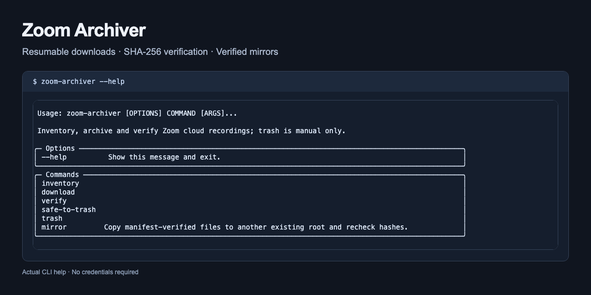

# Zoom Archiver

Archive Zoom cloud recordings into ordinary folders, resume interrupted downloads, verify every file by size and SHA-256, and mirror verified files to another disk or synced folder.

Includes an inventory ledger and a compatible `manifest.json` per meeting. No service or scheduler is installed.

[Install](#install) · [Zoom setup](#server-to-server-oauth-setup) · [Commands](#commands) · [File guarantees](#download-and-manifest-guarantees) · [Folder layout](#folder-layout-and-manifest-fields) · [Mirror](#mirror)

## Install

Requires Python 3.11 or newer and [uv](https://docs.astral.sh/uv/getting-started/installation/). On this repository's GitHub page, choose **Code**, copy the clone URL, and run `git clone` with that URL. Then enter the cloned directory and install:

```sh
cd zoom-archiver
uv sync
uv run zoom-archiver --help

# Offline fixture tests; no Zoom credentials or recordings required.
uv run pytest -q
```

Runtime dependencies are `httpx` and `typer`; `pytest` is for development. Installation and help need no Zoom credentials.

Agents: read [AGENTS.md](AGENTS.md) before making changes. For vulnerability reports, see [SECURITY.md](SECURITY.md).



Actual CLI help captured without credentials.

## Server-to-Server OAuth setup

1. **Create the app.** Sign into the [Zoom App Marketplace](https://marketplace.zoom.us/) as an account owner or admin allowed to create Server-to-Server OAuth apps. Choose Develop → Build App → Server-to-Server OAuth → Create, and name it Zoom Archive. Reopen an existing app to resume setup.
2. **Information.** Complete the required company and developer contact fields. Open App Credentials to locate Account ID, Client ID, and Client Secret. Keep values in your private credential workflow.
3. **Scopes.** Add the following account/admin scopes. No webhook endpoint is required by this polling tool.

   | Scope | Purpose |
   |---|---|
   | `cloud_recording:read:list_user_recordings:admin` | List the selected user's cloud recordings |
   | `cloud_recording:read:list_recording_files:admin` | Refresh files for a meeting instance |
   | `cloud_recording:read:recording:admin` | Recording event scope included in this setup |
   | `cloud_recording:delete:meeting_recording:admin` | Optional: explicit manual trash only |

   See Zoom's [granular scope reference](https://developers.zoom.us/docs/integrations/oauth-scopes-granular/). The `cloud_recording:read:recording:admin` scope is for [recording event subscriptions](https://developers.zoom.us/docs/api/webhooks/); the setup retains it, although this tool polls the API and does not use webhook subscriptions.
4. **Activation.** Activate the app and resolve any required-field errors. Zoom's [S2S OAuth guide](https://developers.zoom.us/docs/internal-apps/s2s-oauth/) describes the account-credentials token exchange; the tool handles tokens in memory.
5. **Credentials.** Supply the three credential variables below through your environment or a resolver hook. Do not put secrets in command arguments, shell history, reports, or committed files. The tool does not read `.env` files or save credentials. Set `ZOOM_USER_ID` to the intended Zoom user ID or email; this tool refuses `me` for S2S inventory/download before sending HTTP requests.
6. **Check.** Run the read-only inventory command below. Confirm the intended meetings before authorizing any archive writes.

| Variable | Meaning |
|---|---|
| `ZOOM_ACCOUNT_ID` | S2S account credential |
| `ZOOM_CLIENT_ID` | S2S client credential |
| `ZOOM_CLIENT_SECRET` | S2S secret |
| `ZOOM_USER_ID` | Non-secret selected user; overridden by `--user-id` |
| `ZOOM_ARCHIVER_ROOT` | Existing archive directory; overridden by `--root` |
| `ZOOM_ARCHIVER_KEY_RESOLVER` | Optional `module:function` resolving credential names |

For a hook, make your module importable in the same Python environment and configure, for example, `ZOOM_ARCHIVER_KEY_RESOLVER=credential_provider:resolve`. The callable receives each of the three credential names above and returns `str | None`. A configured hook is authoritative; it does not fall back to environment values. Hook stdout/stderr is suppressed, missing values produce `auth_state=missing`, and exceptions produce `auth_state=unknown` without exposing their text. User ID and root remain ordinary configuration, independent of this credential hook.

## Commands

Choose an existing archive directory. Creating it is an explicit operator step; the tool refuses an absent root to avoid silently writing into an unmounted disk's directory. Check that the intended disk is mounted first.

```sh
mkdir -p ./recordings
export ZOOM_ARCHIVER_ROOT="$PWD/recordings"
export ZOOM_USER_ID=YOUR_ZOOM_USER_ID

# Remote read only; no archive writes.
uv run zoom-archiver inventory --since 30d --dry-run

# Save inventory and manifests without fetching recording bytes.
uv run zoom-archiver inventory --since 90d --download

# Preview the newest meeting, then explicitly download all of its files.
uv run zoom-archiver download --since 90d --limit 1 --dry-run
uv run zoom-archiver download --since 90d --limit 1 --download

# Independent local size/hash pass; --download records verification metadata.
uv run zoom-archiver verify
uv run zoom-archiver verify --download

# Review eligible meeting UUIDs; save the report only with --download.
uv run zoom-archiver safe-to-trash
uv run zoom-archiver safe-to-trash --download
```

For inventory, download, verify and safe-to-trash, **archive writes require `--download` and the absence of `--dry-run`**. Despite its name, `verify --download` only updates verification metadata. Verify and safe-to-trash run locally without credentials; inventory and download previews still read Zoom. `--root PATH` overrides the root on each command. Exit 0 means success; incomplete verification/downloads and refusals exit 1.

Inventory defaults to every meeting in 90 days; `--limit 0` means unbounded inventory. Download defaults to the newest five meetings and requires a positive limit. Windows cover at most 14 inclusive calendar dates and overlap by one day; meetings are deduplicated by UUID. A response that echoes a different date range is refused so a silently shortened window cannot hide recordings. Pagination is followed before the newest meetings are selected. `--since` accepts an ISO timestamp or durations such as `7d`, `12h`, `2w`.

### Manual trash

```sh
uv run zoom-archiver trash --ids EXACT_MEETING_UUID --yes --dry-run
# After reviewing the preview, this moves remote recordings to Zoom trash:
uv run zoom-archiver trash --ids EXACT_MEETING_UUID --yes
```

`--yes` is mandatory even for a trash preview. Actual trash needs no `--download` flag: `--yes` is its explicit remote mutation gate. Every selection must have all local files verified again; the remote file IDs, completed statuses, and sizes must still match. New remote files block the batch. Prefer exact UUIDs for recurring meetings; numeric meeting IDs must identify exactly one eligible instance. The request is always `action=trash`, never permanent `action=delete`; an uncertain mutation is never blindly retried. Local files remain untouched unless metadata writes were explicitly enabled.

The public default has **no transcript requirement**. To block eligibility and trash while another process works, pass `--transcript-marker-dir PATH` to safe-to-trash and trash. The directory must exist and contain no `.wanted` or `.lock` markers, recursively; symlinks also block it. The gate is checked again immediately before each remote trash call. An empty folder is not evidence of a completed transcript, and external workers must coordinate to avoid creating a marker after the check.

## Download and manifest guarantees

- Each source file streams as raw bytes into `.part`, with identity content encoding and a running SHA-256. The final byte count must equal Zoom's `file_size`; when Content-Length is present, it must equal that size, or the remaining size for a ranged response.
- Interrupted streams retry up to five attempts with 2–60 second exponential backoff and a Range header. Resume requires a matching Content-Range start/end/total. A server that ignores Range is refused without truncating the partial.
- A size/header/hash failure retains the partial or existing final file and returns failure. HTTP errors, scope failures and low disk space produce fixed diagnostics.
- Before each download, available space must cover a 50 GB reserve plus both the expected partial and final sizes. Publication exclusively creates the final path with O_EXCL, copies the verified partial, fsyncs, then checks both files by size/hash; it uses neither overwriting rename nor hard links. The partial remains after success. A competing final, including one appearing during metadata writes, is never replaced. Failed copying retains the complete partial and incomplete final for inspection; retries do not truncate the final. A saved digest supports recovery when publication finished before a crash. A complete partial with no saved digest is retained if Zoom refuses resume; size alone is insufficient proof.
- A separate verification pass re-stats and re-hashes the archive file. Verified files are never downloaded over. If an existing final has no matching ledger proof it is preserved and reported as a mismatch.
- API-provided original `file_name` values are retained exactly when safe. Where Zoom omits a name, the stable fallback is `<recording_type>_<file.id>.<file_extension>`, recorded in the manifest; the collector does not claim these are server-provided names. Duplicate original names use file-ID subdirectories. Meeting-directory collisions use a UUID-derived suffix. Unsafe traversal, symlinks or names colliding with archive metadata are refused.
- `manifest.json.lock` uses O_EXCL, re-read before update, and 30-second stale handling for proven-dead local owners. Active local owners are never stolen; foreign-host or malformed stale locks require inspection. Only owned/stale markers are cleaned up.
- Manifest updates preserve unknown fields, transcripts, mail and notes. Changed meeting/file entries retain the preceding snapshot in `meeting_history` / `file_history`. JSON values preserve exact text; downloaded media/text file bytes are never reformatted.
- `safe-to-trash.md` requires every inventoried file to remain verified after another hash pass, plus the optional marker gate when configured. It is an eligibility report, not a deletion receipt or a transcription-quality assessment.

## Folder layout and manifest fields

```text
<root>/
  _state/
    inventory.sqlite
    safe-to-trash.md
  <YYYY>/<YYYY-MM-DD>_<HHMM>_<topic-slug>_<meeting-id>/
    original.mp4
    original.mp4.part
    manifest.json
    transcripts/             # optional companion-owned files
```

Numeric timestamps in storage paths preserve the established machine layout. Topic slugs use Unicode NFD normalization for macOS SMB compatibility. Repeated meeting/name collisions receive stable suffixes or file-ID subdirectories.

| Manifest field | Content |
|---|---|
| `meeting` | `uuid`, `id`, exact `topic`, `start_time`, `duration_min`, `host_email`, `source` (`zoom-cloud`) |
| `files[]` | Relative `name`, `file_type`, expected `file_size`, `sha256`, archive `status`, `zoom_status`, `downloaded_at`, `verified_at`, `zoom_file_id`, `download_route` (`zoom-s2s-api`) |
| `transcripts`, `mail` | Preserved objects for optional companion integrations |
| `safe_to_trash` | Last explicitly saved eligibility result; never permission to bypass fresh checks |
| `notes` | Preserved list |
| `meeting_history`, `file_history` | Previous changed entry snapshots, added when needed |

Initial file digests/timestamps are null and status is `queued`. Download state proceeds through `downloading` to `verified`; failures record `mismatch(...)` or `missing-on-zoom`. Raw API objects and signed download URLs remain in the local SQLite ledger; manifests contain meeting metadata, not download tokens. Treat the archive and its mirrors as private data. The ledger stores paths relative to the archive root; preserve `_state` when backing up a resumable archive.

## Never loses data

This describes preservation behavior, not protection against every disk failure. The tool never deletes recording bytes, never replaces an existing archive final, and retains partials even after success. It does not turn a failed verification into a fresh overwrite. A missing remote file records its absence without removing local bytes. Only explicit `trash --yes` changes Zoom recordings, using trash rather than permanent deletion.

An exclusively created final is visible during copying: consumers must check the verified manifest/ledger status before using it. An interrupted publication can leave a complete partial and an incomplete final; keep both for inspection. The tool will report the conflict on retry rather than truncate either. Foreign-host locks and uncertain trash outcomes require manual inspection before retrying.

## Mirror

```sh
mkdir -p ./recordings-copy
uv run zoom-archiver mirror --root ./recordings --to ./recordings-copy
```

Both roots must already exist and be disjoint. The command reads manifests and copies only recording rows with a SHA-256 and `verified` or `downloaded` status. It verifies the source against manifest size/hash even when the destination already matches, copies through a unique `.part`, checks it, exclusively creates the final name with O_EXCL, then re-hashes both files. Verified partials remain after success; reserve space for both partial and final copies. Even a racing destination is never overwritten. The mirror lock serializes cooperating writers; do not modify either tree concurrently outside this tool.

Matching destination files are skipped. Differing existing destination recordings are preserved and reported as failures; move them aside for inspection yourself before retrying. Previous changed destination manifests are retained as snapshots. No unlisted files are copied or pruned; missing/unverified rows, bad hashes, unsafe paths, and an empty source return exit 1. A provenance manifest is published only after all its recording rows pass. The output reports `ok`, `copied`, `skipped`, `bad`, and `unverified` counters.

This is a recordings-and-manifests mirror, not a complete backup of `_state`, partials, or companion transcripts. A local read-back of a synced folder does not prove upload to a cloud provider; verify the remote copy independently.

## Embedding and limits

`zoom_archiver.execute(...)` returns a local `RunResult(ok, new_items, auth_state, reason, payload)`. Its per-call `archive_factory`, `key_loader`, `result_factory`, and `client_factory` seams let an embedding application supply policy and reporting. `Archive(root, write=False)` uses the direct existing archive root. A subclass can override `_completed_transcript(directory, transcripts)` with a full source-bound validator; the original download implementation remains shared. `zoom_archiver.cli` owns the CLI and call-time defaults, so tests can patch its dependencies without affecting other callers.

No transcription, diarization, media conversion, Gmail reconciliation, or automatic scheduling is included. Zoom-provided text files are archived as bytes; external companions can populate preserved `transcripts`/`mail` fields. Zoom supplies no upstream SHA-256 here: hashes prove local byte stability, while API size and HTTP length provide completeness checks. They do not independently prove an upstream cryptographic checksum. Available recordings depend on your Zoom account and retention settings.
